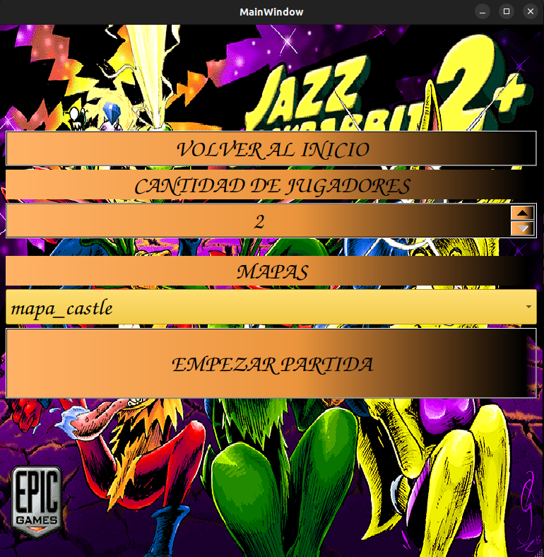
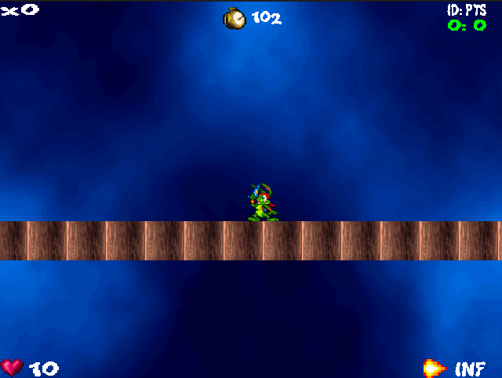

# Manual del Usuario

## 1. Introducción
- ¡Bienvenido al manual del usuario del remake multijugador de Jazz JackRabbit 2!
- Jazz JackRabbit 2 es un shooter de plataformas 2D de los años 90, originalmente desarrollado por Epic MegaGames. En esta versión, hemos hecho una remake multijugador que te permite disfrutar de la acción clásica con tus amigos en línea localmente.
- Este remake se ha desarrollado como parte de un trabajo práctico (TP) para la materia Taller de Programación, Cátedra Veiga, en la Facultad de Ingeniería de la Universidad de Buenos Aires (UBA).

## 2. Requisitos del Sistema
- **Sistema Operativo**
  - Este TP se ha desarrollado y probado en Ubuntu 22.04 LTS. Se recomienda utilizar esta versión o una compatible.
- **Dependencias Necesarias**
  - **Compilador**: `g++` (se recomienda versión 9.3 o superior)
  - **Librerías y Herramientas**:
    - **SDL2pp**: Biblioteca C++ para SDL2.
    - **Qt**: Framework de desarrollo de aplicaciones multiplataforma.

## 3. Instalacion

- **Instalación de Dependencias**
  - **Instalación de SDL**:
    - **Instalación de Dependencias desde apt-get**:
        ```sh
        sudo apt-get install libjpeg-dev libpng-dev libfreetype-dev libopusfile-dev libflac-dev libxmp-dev libfluidsynth-dev libwavpack-dev cmake libmodplug-dev libsdl2-dev
        ```
        Es importante instalar los paquetes `-dev` ya que proporcionan la información necesaria para que CMake vincule estas dependencias.

    - **Instalación de SDL2-image**:
        - Descarga la ultima version de SDL2-image desde [aquí](https://github.com/libsdl-org/SDL_image/releases).
        - Descomprime el archivo, entre a la carpeta y sigue estos pasos:
        ```sh
        mkdir build
        cd build
        cmake ..
        make -j4
        sudo make install
        ```

    - **Instalación de SDL2-mixer**:
        - Descarga la ultima version de SDL2-mixer desde [aquí](https://github.com/libsdl-org/SDL_mixer/releases).
        - Descomprime el archivo, entre a la carpeta y sigue estos pasos:
        ```sh
        mkdir build
        cd build
        cmake ..
        make -j4
        sudo make install
        ```

    - **Instalación de SDL2-ttf**:
        - Descarga la ultima version de SDL2-ttfdesde [aquí](https://github.com/libsdl-org/SDL_ttf/releases).
        - Descomprime el archivo, entre a la carpeta y sigue estos pasos:
        ```sh
        mkdir build
        cd build
        cmake ..
        make -j4
        sudo make install
        ```

    - **Instalación de SDL2pp**:
        - Descarga la ultima version de SDL2pp desde [aquí](https://github.com/libSDL2pp/libSDL2pp/releases).
        - Descomprime el archivo, entre a la carpeta y sigue estos pasos:
        ```sh
        mkdir build
        cd build
        cmake ..
        make -j4
        sudo make install
        ```
  - **Instalación de Qt**:
    ```sh
    sudo apt update
    sudo apt install qt5-default
    ```
- **Instalación del juego**


## 4. Uso del Software
Primeramente, se necesita descargar/clonar el siguiente [repositorio](https://github.com/tomdv18/TpFinalTaller) en una carpeta.

Una vez dentro de la carpeta, debe ejecutar:

  ```sh
  mkdir build
  cd build
  cmake ..
  make
  ```
### 4.1 Abrir el Servidor
Para iniciar el servidor del juego, debe ejecutar:

  ```sh
  ./servidor <puerto>
  ```
El servidor debería iniciarse y estar listo para aceptar conexiones de los clientes.

### 4.2 Abrir el Cliente
Para iniciar el cliente del juego, debe ejecutar:

  ```sh
  ./cliente <localhost> <puerto>
  ```
El cliente se iniciará y te permitirá conectarte al servidor ingresando la dirección IP y el puerto del servidor.

### 4.3 Cómo Jugar
Una vez que hayas ejecutado tanto el servidor como el cliente, sigue estos pasos para jugar:

1. **Seleccionar Personaje**:
    - Elige entre los personajes disponibles (Jazz, Spaz, Lori).
    
  

2. **Crear/Unirse partida**:
    - Seleccion si desea crear/unirse a una partida.
      - Si crea una partida, debe poner la cantidad de jugadores que puede haber y empezarla.
      
    

      - Si se une a una partida, debe seleccionar que partida unirse. 
      
    

    - En ambas opciones, siempre puede volver hacia atras si se quiere
    cambiar la opcion seleccionada.

3. **Interfaz**
    - Una vez dentro de la partida, se encontrara con lo siguiente:
    
    

    - En la parte superior, vera la cantidad de puntos que acumula el jugador (lado izquierdo), y el top 3 de puntajes de los jugadores totales que haya en la partida hasta el momento(lado derecho).

    - En la parte inferior, vera la vida que tiene el jugador (lado izquierdo) y el arma que posee actualmente (lado derecho).

4. **Control del Personaje**:
    - `w`: Saltas
    - `a`: Te mueves a la izquierda
    - `d`: Te mueves a la derecha
    - `l`: Disparas
    - `k`: Habilidad especial
    - `r`: Cambiar arma
    - `q`: Salir de la partida
    - `shift + a/d`: Corres

    

5. **Dañar enemigo/personaje**:
    - A los enemigos/personaje se les puede dañar usando un arma.

    


    


6. **Obtener puntos**
    - Se puede obtener puntos a traves de la obtencion de gemas/monedas.

    


7. **Cambiar arma**
    - Se puede obtener armas a traves del mapa.

    


8. **Objetivo del Juego**:
    - El objetivo del juego es sumar la mayor cantidad de puntaje posible. Esto se logra dañando enemigos, jugadores (utilizando diversas armas y habilidades especiales) o agarrando gemas/monedas.

9. **Finalizacion del Juego**:
    - El juego finaliza una vez transcurrido cierto tiempo. Al terminar, se mostrara por pantalla la tabla de puntajes y un mensaje verificando de que si
    has ganado o no.

    

    


## 5. Configuración y Personalización
- **Ajustes del Usuario**
  - El juego utiliza archivos de configuración para ajustar varios parámetros. Estos archivos están ubicados en el directorio principal del juego.
  - **Archivo de Configuración**: `configuracion.yaml`
    - Ejemplo de contenido del archivo `configuracion.yaml`:
    ```yaml
    personaje:
      vida: 340
      velocidad_x: 5
      velocidad_y: 30 
      gravedad: 3
      tiempo_invulnerabilidad: 3.0
      tiempo_intoxicacion: 5.0
      ancho: 50
      alto: 50

    jazz:
      enfriamiento_habilidad: 5.0
      velocidad_y_habilidad: 45 

    spaz:
      enfriamiento_habilidad: 5.0
      velocidad_x_habilidad: 15
    
    ...

    ```
  - Para modificar la configuración, abre el archivo `configuracion.yaml` con un editor de texto y ajusta los parámetros según tus necesidades.
